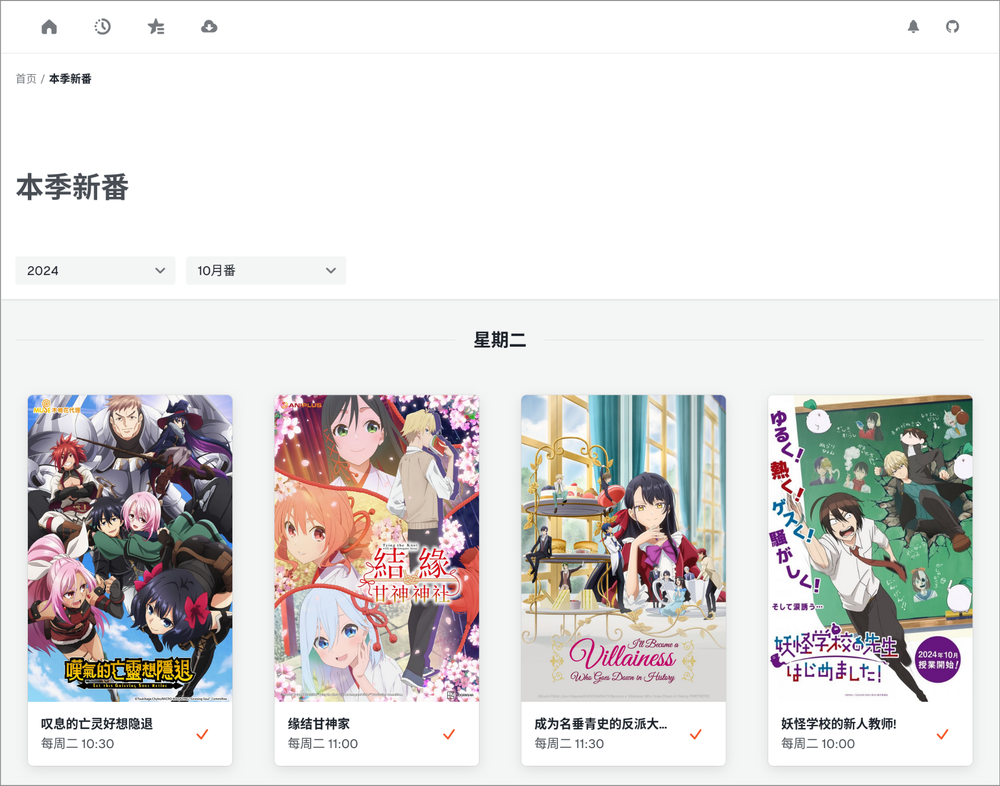
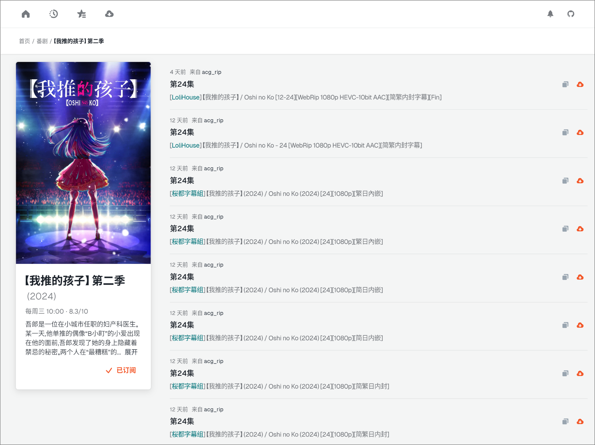

# Forrit

Bangumi tracker, subscribe manager and downloader with an elegant web UI and robust backend server.

## Screenshots

 

## Installation

### Docker

TODO

### Nix Flake

You can use `github:George-Miao/flake` as a flake to run `forrit`:

```sh
nix run 'github:George-Miao/forrit' -- $MY_CONFIG_PATH
```

Notice that `MY_CONFIG_PATH` is optional. If not provided, `forrit` under default [config path](https://docs.rs/dirs/latest/dirs/fn.config_dir.html) alone with environmental variables will be used to config forrit server.

Or you can also compose with your own system config:

```nix
{
  inputs.forrit.url = "github:George-Miao/forrit";
  outputs = { self, nixpkgs, forrit }:
    let
      # ... other items include initialize of nixpkgs
      settings = {
        http.bind = "0.0.0.0:80";
        # other forrit settings
      };
      cfg = builtins.toFile "forrit.json" (builtins.toJSON settings);
      forrit-server = flake.self.inputs.forrit.outputs.forrit-server."x86_64-linux";
      forrit-module = {
        systemd.services.forrit-server = {
          description = "Bangumi tracker and downloader";
          requires = ["network-online.target"];
          wantedBy = ["multi-user.target"];
          script = "${forrit-server}/bin/forrit-server ${cfg}";
        };

        networking.firewall.allowedTCPPorts = [80];
      };
    in {
      nixosConfigurations.my-host = pkgs.lib.nixosSystem {
        modules = [
          forrit-module
          # Other modules
        ];
      };
    };
}
```

### Manual

You well need

- `rust` with nightly release
- `node.js` with `pnpm`
- [`just`](https://github.com/casey/just)

1. Install required dependencies (if you're using nix, you can do this by simply running `direnv allow` or `nix shell ".#shell"`)
2. Clone this repo and `cd` into it
3. Run `just build_frontend` to build the frontend (optional, since the frontend is already built with CI and included in the repo)
4. Run `just build_server` and copy the binary `./target/release/forrit-server` to your desired location

## Components

### Resolver

Uses [TMDB API](https://developers.themoviedb.org/3) and [bangumi-data](https://github.com/bangumi-data/bangumi-data) to index all bangumi's and build the database. Then extract and match episode info from torrent and filename received from sourcers.

### Sourcer

- [x] Any RSS feed that contains Bangumi updates (e.g. [Bangumi](https://bangumi.moe), [ACG.RIP](https://acg.rip) or [Mikan Project](https://mikanani.me))

### Dispatcher

Manages subscription related operations. Received update from sourcers and send it to downloader if it's subscribed.

### Notifier

TODO

### Downloader

- [x] QbitTorrent
- [ ] Transmission
- [ ] aria2
- [ ] rqbit (?)

## TODO

- [ ] (Frontend) Download job page
- [ ] (Frontend) Entry detail page
- [ ] (Frontend) Fix wrong matching (entry - meta) and create alias for the fix
- [ ] (Frontend) Manually override season info (meta)
- [ ] (Server) RSS html Sanitization (w/ [ammonia](https://github.com/rust-ammonia/ammonia))
- [ ] (Server) Read torrent info for better resolution and file size
- [ ] (Server) Transmission API
- [ ] (Server) Notifier (w/ [pling](https://github.com/EdJoPaTo/pling))
- [ ] (Server) Search
- [ ] (Server) Events
- [ ] (Server) Backoff for failed API request

## License

MIT
